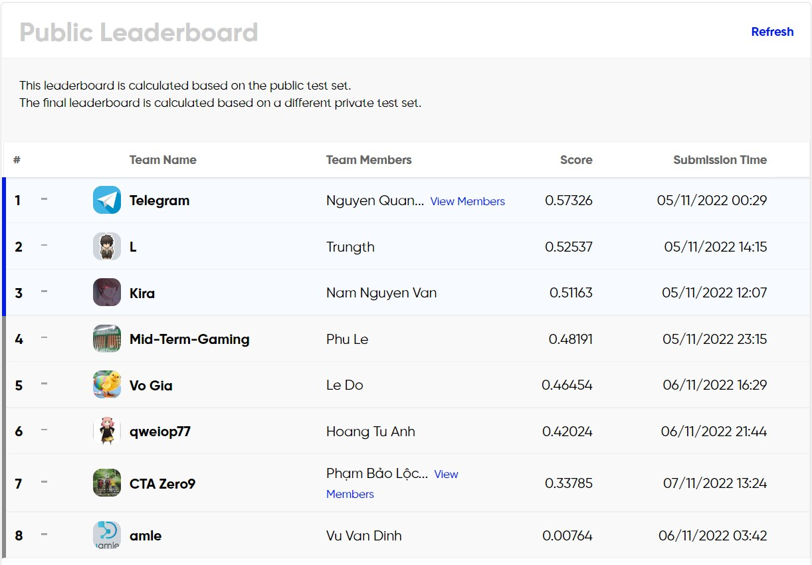

# Zalo AI Challenge 2022 - LyricAlignment

[**Introduction**](#introduction) | [**Solutions**](#solutions) [[**MFA**](#montreal-forced-aligner)]
## Team members:
- Truong Minh Khoa <a href="https://github.com/bipowerhcmcity">(Github)</a>
- Vo Nguyen Khoi
- Pham Bao Loc <a href="https://github.com/BaoLocPham">(Github)</a>

## Introduction
### Problem statement

Many of us love to sing along with songs in the way of our favorite singers in albums (karaoke style). To make it, we may need to remove the vocals of the singer(s) from the songs, then provide the lyrics aligned timely with the accompaniment sounds. There are various tools to remove vocals, but it is hard to align the lyrics with the song.

In this challenge, participants will build a model to align lyrics with a music audio.

- Input: a music segment (including vocal) and its lyrics.

- Output: start-time and end-time of each word in the lyrics.

### Dataset
[Training data]:
1057 music segments from ~ 480 songs.

Each segment is provided with an audio formatted as WAV file and a ground-truth JSON file which includes lyrics and aligned time frame of each single word as the above example.

[Testing data]:
Public test: 264 music segments from ~ 120 songs without aligned lyric files.

[Private test]: 464 music segments from ~ 200 songs without aligned lyric files.

### Evaluation Metric
Accuracy of prediction will be evaluated using Intersection over Union (IoU).

IoU of prediction and the ground truth of an audio segment (𝑠𝑖) is computed by the following formula:

where 𝑚 is the number of tokens of 𝑠𝑖.

Then the Final IoU of across all 𝑛 audio segments is the average of their corresponding IoUs.

## Solutions
### Montreal Forced Aligner
The Montreal Forced Aligner is a command line utility for performing forced alignment of speech datasets using Kaldi (http://kaldi-asr.org/).

For details: <a href="https://github.com/vnk8071/CTA-Zero9-ZAIC2022-Lyric-Alignment/tree/master/mfa">MFA folder</a>
### Baseline on Public Test
- Use pre-trained model.
- Use upper case for split sequence.
- Add ending comma in each sequence.

Result:

### Improvement (Coming soon)